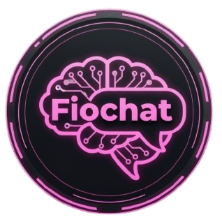

# Documentación del Proyecto: Fiochat - Asistente de IA Educativo

## Propósito y Contexto Educativo

Este chatbot interactivo, denominado **Fiochat**, fue desarrollado como una herramienta de apoyo para **clases de nivel secundaria** (o preparatoria).

Su principal objetivo es:

1. **Facilitar el aprendizaje** de conceptos complejos relacionados con la **Inteligencia Artificial** (IA), el **Aprendizaje Automático** (*Machine Learning*) y las **Redes Neuronales**.

2. Ofrecer un **asistente virtual** que responde a las preguntas de los estudiantes de manera **amigable, concisa y motivadora**, adoptando el rol de un profesor virtual.

3. Servir como un ejemplo práctico de cómo se puede integrar una **API de modelo de lenguaje grande (LLM)** en una aplicación web moderna.

El bot está configurado con una instrucción de sistema específica para mantener un tono adecuado y respuestas breves, mejorando la experiencia educativa.

## Componentes y Tecnologías Utilizadas

El desarrollo de esta aplicación de chat se basa en la librería **React**, garantizando una interfaz de usuario dinámica y eficiente. Se utilizaron los siguientes componentes clave y librerías de terceros:

* **React (Frontend):** La biblioteca principal para construir la interfaz de usuario.

* **React Bootstrap:** Utilizado para el **diseño responsivo y la estética** de la interfaz. Esto incluye componentes como `Container`, `Row`, `Col`, `Button`, `Card` y `Form`, que aseguran una buena experiencia de usuario tanto en escritorio como en dispositivos móviles.

* **ReactMarkdown:** Permite al chatbot renderizar texto enriquecido, utilizando el formato Markdown (por ejemplo, **negrita**) que la IA genera para mejorar la legibilidad de las explicaciones.

* **API de Gemini (gemini-2.5-flash):** El corazón de la aplicación. Esta API se utiliza para la generación de texto, lo que le da al chatbot su capacidad de respuesta y conocimiento.

* **Gestión de Estado (`useState`, `useEffect`):** Se emplean *Hooks* de React para manejar el historial de la conversación, el estado de escritura (`isTyping`) y el scroll automático al final del chat.